# Q 1 :
```
create table Employee3 as select Empno as id,LastName as LastName,DepNO  as Deptid from  Employee2

DESC Employee3
```
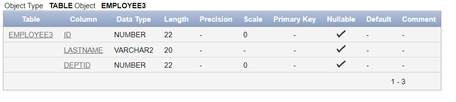
# ---------------------------------------

# Q 2 :

```
INSERT INTO employee2(Empno,LastName,DepNO) VALUES (101,'EBI',100)
```
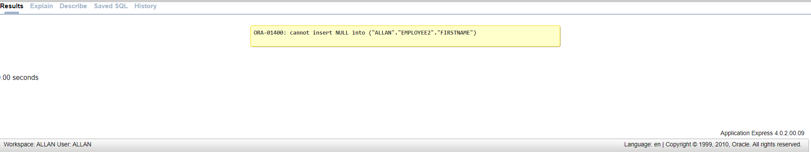

# --------------------------------------

# Q 3 .
```
INSERT INTO employee2(Empno,LastName,DepNO) VALUES (101,'EBI',100)

INSERT INTO  Department3(Deptno,Deptname,Location,Floor) VALUES (10,'Accounts','Trivandrum',2)
 
INSERT INTO employee2(EMPNO,MANAGERID,FIRSTNAME,LASTNAME,USERID,DEPNO,SALARY,COMMISSION,JOININGDATE,DESIGNATION,HRA,PF)VALUES(11,11,'ALLA','MA','KK',100,100,'WE','12-12-2023','SE',10,50);

SELECT * FROM Department3
SELECT * FROM employee2


DESC Department3


SELECT * FROM Department3 WHERE Deptno = 100;
INSERT INTO Department3 (Deptno, Deptname, Location) VALUES (100, 'Sales', 'New York');

SELECT * FROM Department3 WHERE Deptno IN (200, 400);


INSERT INTO Department3 (Deptno, Deptname, Location, Floor) 
VALUES (200, 'IT', 'New York', 5);

INSERT INTO Department3 (Deptno, Deptname, Location, Floor) 
VALUES (400, 'HR', 'San Francisco', 3);

INSERT INTO Employee2 (EMPNO, MANAGERID, FIRSTNAME, LASTNAME, USERID, DepNO, SALARY, COMMISSION, JOININGDATE, DESIGNATION, HRA, PF) 
VALUES (12, 13, 'ALL', 'M', 'K', 200, 300, 10, TO_DATE('13-12-2023', 'DD-MM-YYYY'), 'SD', 20, 60);

INSERT INTO Employee2 (EMPNO, MANAGERID, FIRSTNAME, LASTNAME, USERID, DepNO, SALARY, COMMISSION, JOININGDATE, DESIGNATION, HRA, PF) 
VALUES (14, 15, 'ALLA', 'MA', 'KK', 400, 500, 10, TO_DATE('14-12-2023', 'DD-MM-YYYY'), 'SG', 30, 70);

INSERT INTO Employee2 (EMPNO, MANAGERID, FIRSTNAME, LASTNAME, USERID, DepNO, SALARY, COMMISSION, JOININGDATE, DESIGNATION, HRA, PF) 
VALUES (33, 21, 'AA', 'AC', 'AK', 200, 900, 70, TO_DATE('12-11-2023', 'DD-MM-YYYY'), 'SW', 50, 80);
SELECT * FROM employee2

```
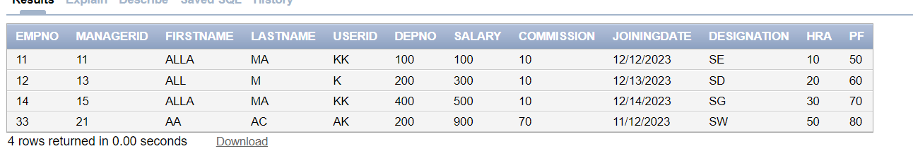

# --------------------------------------------
# Q4 
```
INSERT INTO  Department3(Deptno,Deptname,Location,Floor) VALUES (10,'Accounts','Trivandrum',2)

SELECT * FROM Department;
```
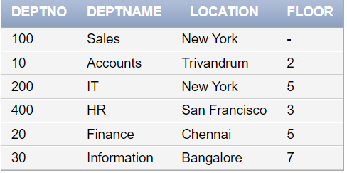
# --------------------------------------------------
# Q 5
```
SELECT * FROM Department3


SELECT * FROM Employee2
```
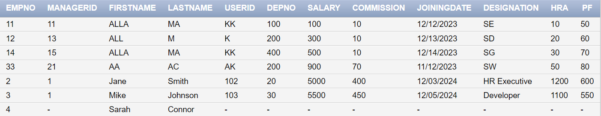
# -------------------------------------------------
# Q6
```
Select * from customer
```
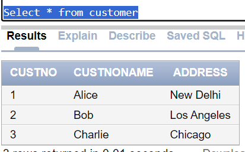
# -----------------------------------------------------
# Q7
```
UPDATE Customer SET Address = 'New Delhi' WHERE Custno = 002
Select * from customer
```
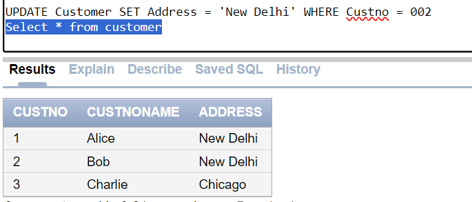

# --------------------------------
# Q8
```
DELETE FROM Employee2 WHERE salary>5000
Select * from Employee2
```
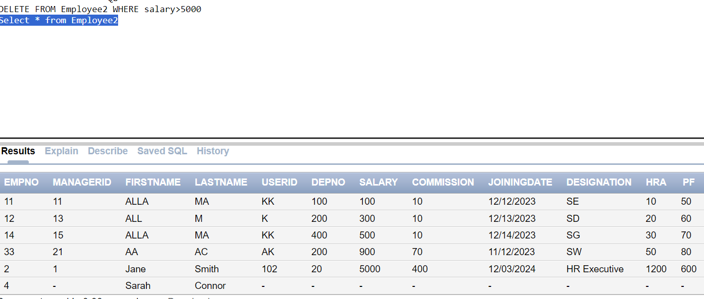
# -------------------------------------
# Q9
```
UPDATE Employee2 SET DEPNO= 100 ,FirstName = 'Rio' WHERE EMPNO = 11

Select * from Employee2
```
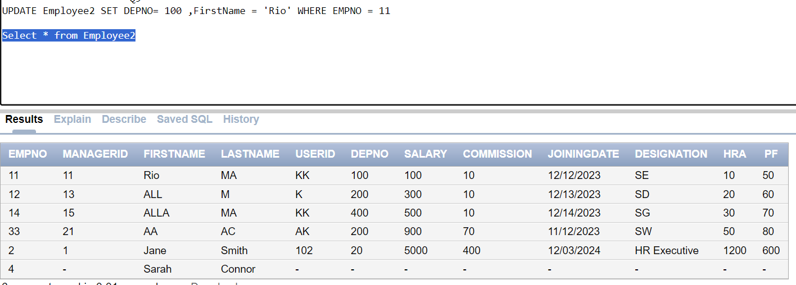
# -0-----------------------------------------------
# Q10
```
UPDATE Student2
SET Email = 'john.smith@example.com', Telephone = '1234567890'
WHERE StudID = 1;

UPDATE Student2
SET Email = 'jane.doe@example.com', Telephone = '9876543210'
WHERE StudID = 2;

UPDATE Student2
SET Email = 'mike.johnson@example.com', Telephone = '5551234567'
WHERE StudID = 3;

UPDATE Student2
SET Email = 'alice.brown@example.com', Telephone = '7779876543'
WHERE StudID = 4;

UPDATE Student2 
SET Email = 'NA';

UPDATE Student2 
SET Email = 'NA' 
WHERE Email IS NULL OR Email = '';

Select * from student2
```
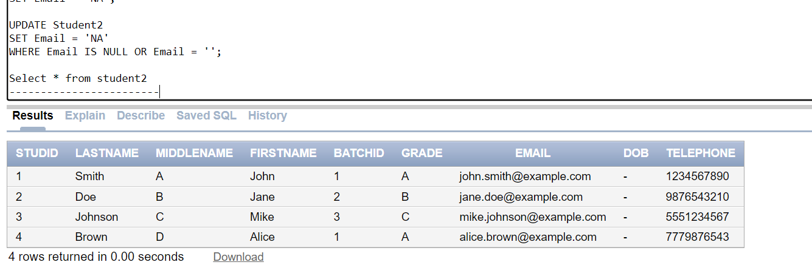

# q11
```
UPDATE Student2
SET Email = 'john.smith@example.com', Telephone = '1234567890', age = 18
WHERE StudID = 1;

UPDATE Student2
SET Email = 'jane.doe@example.com', Telephone = '9876543210', age = 22
WHERE StudID = 2;

UPDATE Student2
SET Email = 'mike.johnson@example.com', Telephone = '5551234567', age = 20
WHERE StudID = 3;

UPDATE Student2
SET Email = 'alice.brown@example.com', Telephone = '7779876543', age = 19
WHERE StudID = 4;

Select * from student2
    
DESC Student2;

DELETE FROM Student2 WHERE age > 20;


select * from student2
```
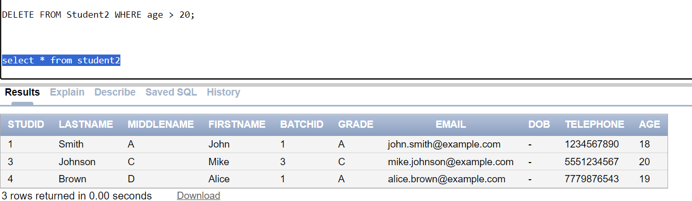
# -----------------------------
# q12
```
DELETE FROM student Where telephone is NULL AND Email = 'NA'
SELECT * FROM student2
```
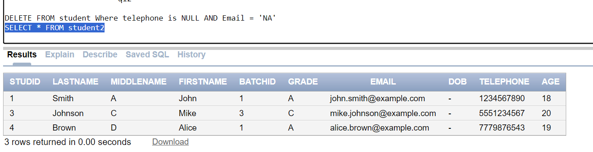

# ------------------------------------------

# Q13

```
DELETE FROM student2 WHERE dob = '06-05-2001'
select * from student2
```
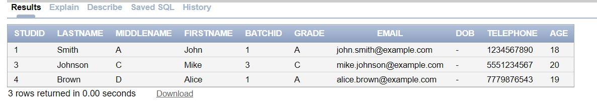
# --------------------------------
# q14
```
UPDATE Student2 
SET FirstName = 'XXX', 
    DOB = SYSDATE;
UPDATE Student2 
SET FirstName = 'XXX', 
    DOB = SYSDATE 
WHERE INSTR(FirstName, 'a') > 0;
SELECT * FROM Student2;
```
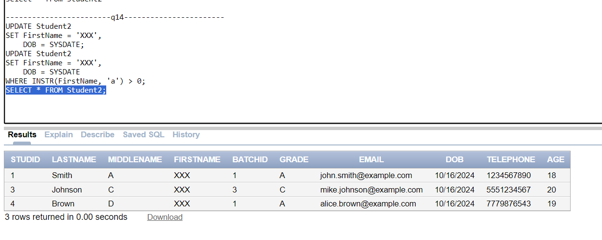

# -----------------
# q15
```
DELETE FROM Student2 WHERE LASTNAME LIKE '%a%';

Select * from student2
```

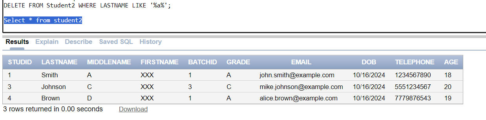
# ------------------------------------
# q16
```
INSERT INTO Student2 (StudID, LastName, MiddleName, FirstName, BatchID, Grade, Email, DOB, Telephone, Age)
VALUES (5, 'Doe', 'E', 'Jane', 2, 'B', 'jane.doe@example.com', '10-01-2015', '8889990000', 23);


UPDATE Student2 SET LastName = 'Jan' WHERE EXTRACT(MONTH FROM Dob) = 1
select * from student2
```
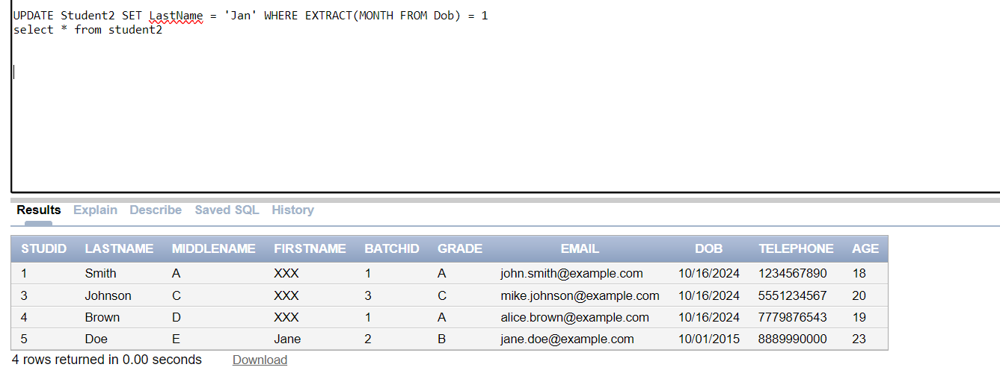
# --------------------------------------------
# q 17
```
UPDATE Student2
SET Email = 'mike.johnson@example.com', 
    Telephone = '5551234567', 
    Age = 20
WHERE StudID = 3;


DELETE FROM student2 where LASTNAME LIKE 'T%'
select * from student2
```
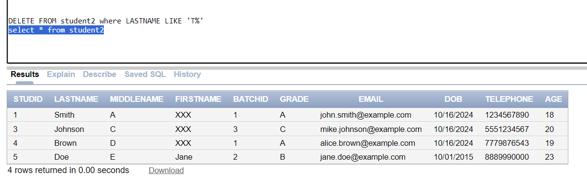


