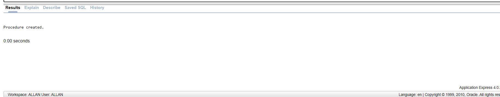

# 1 Create a function that returns the number of employees in a department [Parameter taken by the function is deptid] :

```
CREATE FUNCTION get_employee_count(deptid NUMBER)
RETURN NUMBER
IS
    emp_count NUMBER;
BEGIN
    SELECT COUNT(*)
    INTO emp_count
    FROM Employee2
    WHERE DEPNO = deptid;

    RETURN emp_count;
END get_employee_count;

DECLARE
employee_count NUMBER;

BEGIN
employee_count := get_employee_count(100);


    DBMS_OUTPUT.PUT_LINE('Number of employees in department ' || employee_count);
END;

```


# ------------------------------------------------

# 2.Create a function that takes in marks and maxmarks and returns the percentage scored

```
CREATE FUNCTION calculate_percentage(marks NUMBER, maxmarks NUMBER)
RETURN NUMBER
IS
    percentage NUMBER;
BEGIN
    IF maxmarks = 0 THEN
        RETURN NULL; -- To avoid division by zero
    ELSE
        percentage := (marks / maxmarks) * 100;
        RETURN percentage;
    END IF;
END;
```


# --------------------------------------------------------------

# 3.Create a procedure that displays employee details, department details of a particular employee id :

```
CREATE OR REPLACE PROCEDURE display_employee_dept_details(emp_id NUMBER)
IS
    v_firstname Employee2.FIRSTNAME%TYPE;
    v_lastname Employee2.LASTNAME%TYPE;
    v_deptname DEPARTMENT3.DEPTNAME%TYPE;
    v_location DEPARTMENT3.LOCATION%TYPE;
BEGIN
    SELECT e.FIRSTNAME, e.LASTNAME, d.DEPTNAME, d.LOCATION
    INTO v_firstname, v_lastname, v_deptname, v_location
    FROM Employee2 e
    JOIN DEPARTMENT3 d ON e.DEPNO = d.DEPTNO
    WHERE e.EMPNO = emp_id;

    DBMS_OUTPUT.PUT_LINE('Employee Name: ' || v_firstname || ' ' || v_lastname);
    DBMS_OUTPUT.PUT_LINE('Department: ' || v_deptname);
    DBMS_OUTPUT.PUT_LINE('Location: ' || v_location);

EXCEPTION
    WHEN NO_DATA_FOUND THEN
        DBMS_OUTPUT.PUT_LINE('No employee found with the given ID.');
END;

BEGIN

display_employee_dept_details(11);
END;
```


# ------------------------------------------------------------------

# 4.Implement a function that calculates and returns the average salary of a dept

```
CREATE FUNCTION get_average_salary(deptid NUMBER)
RETURN NUMBER
IS
    avg_salary NUMBER;
BEGIN
    SELECT AVG(SALARY)
    INTO avg_salary
    FROM Employee2
    WHERE DEPNO = deptid;

    RETURN avg_salary;
END get_average_salary;


DECLARE
avg_salary NUMBER;
BEGIN
avg_salary :=getaveragesalary;
DBMS_OUTPUT.PUT_LINE('THE AVG IS : ' || avg_salary );
END;
```


# -----------------------------------

# 5 Write a procedure for adding a new supplier into the supplier table, where the supplier table contains supplier_id, supplier_name and location. Proper exception handling should be done for duplicate value on the supplier id.

```
CREATE TABLE supplier (
    supplier_id NUMBER(10) PRIMARY KEY,
    supplier_name VARCHAR(100),
    location VARCHAR(100)
);

CREATE OR REPLACE PROCEDURE AddNewSupplier(
    p_supplier_id IN NUMBER,
    p_supplier_name IN VARCHAR2,
    p_location IN VARCHAR2
)
IS
BEGIN
    INSERT INTO supplier (supplier_id, supplier_name, location)
    VALUES (p_supplier_id, p_supplier_name, p_location);

    DBMS_OUTPUT.PUT_LINE('Supplier added successfully.');

EXCEPTION
    WHEN DUP_VAL_ON_INDEX THEN
        DBMS_OUTPUT.PUT_LINE('Error: Duplicate supplier ID. Supplier with ID ' || p_supplier_id || ' already exists.');
    WHEN OTHERS THEN
        DBMS_OUTPUT.PUT_LINE('Error: ' || SQLERRM);
END;

BEGIN
    AddNewSupplier(1, 'Supplier A', 'KANNUR');
    AddNewSupplier(2, 'Supplier B', 'Los Angeles');
    AddNewSupplier(3, 'Supplier C', 'Chicago');
END;

BEGIN
    AddNewSupplier(1, 'Supplier D', 'TVM');

END;

SELECT * FROM
```


# ----------------------------

# 6.Write a procedure that will get the value from the user and insert rows into employee table without violating any of the integrity constraints.

```
CREATE OR REPLACE PROCEDURE add_employee(
    empno NUMBER, 
    managerid NUMBER, 
    firstname VARCHAR2, 
    lastname VARCHAR2, 
    userid VARCHAR2, 
    depno NUMBER, 
    salary NUMBER, 
    commission NUMBER, 
    joiningdate DATE, 
    designation VARCHAR2, 
    hra NUMBER, 
    pf NUMBER)
IS
BEGIN
    INSERT INTO Employee2 (EMPNO, MANAGERID, FIRSTNAME, LASTNAME, USERID, DEPNO, SALARY, COMMISSION, JOININGDATE, DESIGNATION, HRA, PF)
    VALUES (empno, managerid, firstname, lastname, userid, depno, salary, commission, joiningdate, designation, hra, pf);
    
    DBMS_OUTPUT.PUT_LINE('Employee added successfully.');
    
EXCEPTION
    WHEN OTHERS THEN
        DBMS_OUTPUT.PUT_LINE('Error: ' || SQLERRM);
END;
begin
```


# 7.Write a procedure, which can be used to insert a new department in DEPT table.

```
CREATE OR REPLACE PROCEDURE add_department(deptno NUMBER, deptname VARCHAR2, location VARCHAR2, floor NUMBER)
IS
BEGIN
    INSERT INTO DEPARTMENT3 (DEPTNO, DEPTNAME, LOCATION, FLOOR)
    VALUES (deptno, deptname, location, floor);

    DBMS_OUTPUT.PUT_LINE('Department added successfully.');

EXCEPTION
    WHEN DUP_VAL_ON_INDEX THEN
        DBMS_OUTPUT.PUT_LINE('Error: Department ID already exists.');
END;

BEGIN
    add_department(
        101, 'EVS', 'KOLLAM', 9
    );
END;
select * from  DEPARTMENT3
```


# ------------------------------------------------------

# 8.Write a program which accepts employee number and amount and calls a procedure which does the following actionsa. Update the salary of employee with the given amount.Handle exceptions if there is no such employee record.

```
CREATE OR REPLACE PROCEDURE UPDATE_EMPLOYEE_SALARY(
    p_EmpNo IN NUMBER,
    p_Amount IN NUMBER
)
IS
BEGIN
    UPDATE Employee2
    SET Salary = Salary + p_Amount
    WHERE EmpNo = p_EmpNo;

    IF SQL%ROWCOUNT = 0 THEN
        RAISE_APPLICATION_ERROR(-20001, 'Error: No employee found with the given employee number.');
    END IF;

    DBMS_OUTPUT.PUT_LINE('Salary updated successfully.');
EXCEPTION
    WHEN OTHERS THEN
        DBMS_OUTPUT.PUT_LINE('Error: ' || SQLERRM);
END UPDATE_EMPLOYEE_SALARY;

DECLARE
    v_EmpNo NUMBER := 11;
    v_Amount NUMBER := 300;
BEGIN
    UPDATE_EMPLOYEE_SALARY(v_EmpNo, v_Amount);
END;

```


# -----------------------------------------------------------


