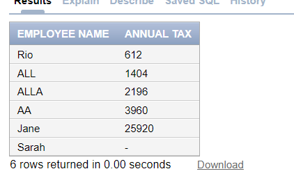
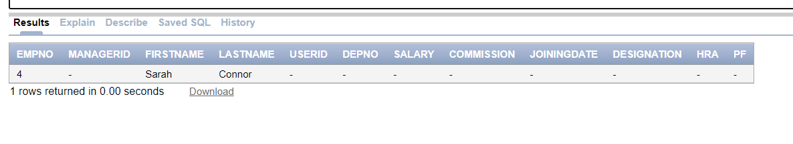

# Q 1 :
```
SELECT * FROM Employee2SELECT 	FIRSTNAME AS "EMPLOYEE NAME",((SALARY +COMMISSION + HRA + PF)*12)*0.30 AS "ANNUAL TAX" FROM Employee2
DESC Employee2
select * from Employee2
```


# ----------------------------------------------

# Q 2 :

# Q 3 :

# -------------------------------------
# Q 4 :
```
INSERT INTO employee2 (EMPNO, MANAGERID, FIRSTNAME, LASTNAME, USERID, DEPNO, SALARY, COMMISSION, JOININGDATE, DESIGNATION, HRA, PF) 
VALUES 
(1, 101, 'Anant', 'Singh', 'anant.singh', 10, 50000, 5000, '10-11-2021', 'Software Engineer', 10000, 4000); 

DESC Employee2
SELECT * FROM Employee2 WHERE FIRSTNAME LIKE 'A%%t' 
```

# --------------------------------------------

# Q 5 :

```
SELECT * FROM employee2 WHERE JOININGDATE > TO_DATE('01-Jan-1998', 'DD-Mon-YYYY') AND SALARY > 25000;
```


# -----------------------------------------------

# Q 6 : 

```
SELECT * FROM employee2 WHERE COMMISSION IS NULL OR COMMISSION = 0;
```


# ---------------------------------------------------

# Q 7 : 
```
SELECT 'Festival offer' AS "Festival offer",
       PRODUCTNAME || ' costs ' || TO_CHAR(PRICEUNIT, '99999.99') || ' after discount' AS "Product Details"
FROM product;
```


# -----------------------------------------------------

# Q 8 :
```
SELECT * FROM product WHERE PRICEUNIT > 50 AND PRICEUNIT < 100;
```

# ---------------------------------------------

# Q 9 :
```
SELECT * FROM product WHERE PRICEUNIT >= 50 AND PRICEUNIT <= 100;
```


# -----------------------------------------------------

# Q 10 :
```
SELECT DISTINCT DESIGNATION FROM employee2;
```


