# room table :
```
CREATE TABLE Room (
room_id NUMBER PRIMARY KEY,  
category VARCHAR2(50),       
room_no VARCHAR2(10) UNIQUE, 
rate_per_day NUMBER,        
occupancy VARCHAR2(10) 
);

INSERT ALL 
INTO Room (room_id, category, room_no, rate_per_day, occupancy) VALUES (1, 'Single', '101', 1500, 'unoccupied')
INTO Room (room_id, category, room_no, rate_per_day, occupancy) VALUES (2, 'Double', '102', 2500, 'occupied')
INTO Room (room_id, category, room_no, rate_per_day, occupancy) VALUES (3, 'Suite', '201', 5000, 'occupied')
INTO Room (room_id, category, room_no, rate_per_day, occupancy) VALUES (4, 'Suite', '202', 5500, 'unoccupied')
INTO Room (room_id, category, room_no, rate_per_day, occupancy) VALUES (5, 'Single', '103', 1400, 'unoccupied')
INTO Room (room_id, category, room_no, rate_per_day, occupancy) VALUES (6, 'Double', '104', 2600, 'occupied')

SELECT * FROM DUAL
SELECT * FROM Room
```
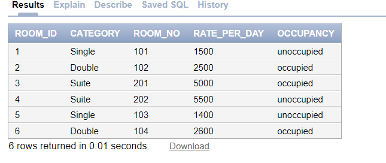

# ---------------------------------------------------------------------------

# customer table :
```
CREATE TABLE Customer1(
customer_id NUMBER PRIMARY KEY,  
customer_name VARCHAR2(100)  
);


INSERT ALL
INTO Customer1 (customer_id, customer_name) VALUES (1, 'John')
INTO Customer1 (customer_id, customer_name) VALUES(2,  'sha')
INTO Customer1 (customer_id, customer_name) VALUES(3, 'ebi')
INTO Customer1 (customer_id, customer_name) VALUES(4, 'Abi')
SELECT * FROM DUAL
SELECT * FROM customer1
```
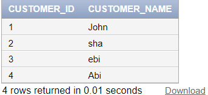
# ----------------------------------------------

# booking table :
```
CREATE TABLE Booking (
booking_id NUMBER PRIMARY KEY,       
customer_id NUMBER,                  
room_id NUMBER,                      
date_of_booking DATE,                
date_of_occupancy DATE,              
no_of_days NUMBER,                   
advance_received NUMBER,             
FOREIGN KEY (customer_id) REFERENCES Customer1(customer_id),
FOREIGN KEY (room_id) REFERENCES Room(room_id)
);

INSERT INTO Booking (booking_id, customer_id, room_id, date_of_booking, date_of_occupancy, no_of_days, advance_received) VALUES (1, 1, 3,'10-12-2021','10-16-2021',5, 2500)

INSERT INTO Booking (booking_id, customer_id, room_id, date_of_booking, date_of_occupancy, no_of_days, advance_received) VALUES (2, 2, 2,'10-18-2023','10-19-2023',3, 1500)
INSERT INTO Booking (booking_id, customer_id, room_id, date_of_booking, date_of_occupancy, no_of_days, advance_received)VALUES(3, 3, 6,'10-20-2023','10-21-2023', 4, 2000)
INSERT INTO Booking (booking_id, customer_id, room_id, date_of_booking, date_of_occupancy, no_of_days, advance_received)VALUES(4, 4, 4,'10-22-2023','10-23-2023', 2, 3000)


select * from Booking
```
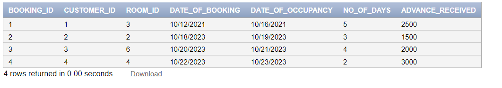

# ---------------------------------------------------------
# Q 1 :
```
SELECT category, room_no, rate_per_day 
FROM Room
```
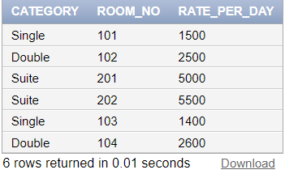


----------------------------------------------------------

# Q 2 :
```
SELECT room_no
FROM Room r 
JOIN Booking b ON r.room_id = b.room_id
WHERE b.date_of_occupancy BETWEEN ('10-20-2023') 
AND ('10-23-2023')+2;
```
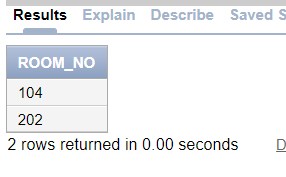
# ---------------------------------------------------

# Q3 :

```
SELECT room_no, rate_per_day
FROM Room
ORDER BY rate_per_day ASC;
```
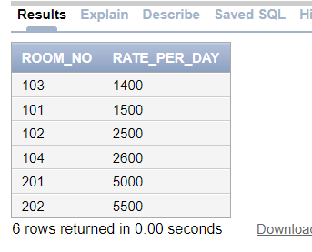

# -----------------------------------

# Q 4 :

```
SELECT room_no, rate_per_day
FROM Room
WHERE rate_per_day > 2000
ORDER BY rate_per_day DESC;
```
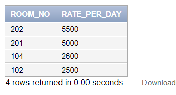

# ------------------------------------------------

# Q 5 :
```
SELECT SUM(rate_per_day) AS total_rate
FROM Room;
```
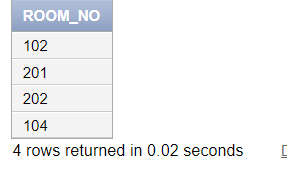
# --------------------
# Q 6 :
```
SELECT room_no
FROM Room r 
JOIN Booking b ON r.room_id = b.room_id
WHERE b.advance_received > 0;
```


# ---------------------------------------------------------

# Q7:

```
SELECT room_no
FROM Room r 
JOIN Booking b ON r.room_id = b.room_id
WHERE b.date_of_occupancy BETWEEN ('10-20-2023') 
AND ('10-23-2023');
```
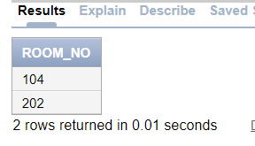

# ---------------------------------------

# Q8:
```
SELECT c.customer_name, r.room_no
FROM Customer1 c
JOIN Booking b ON c.customer_id = b.customer_id
JOIN Room r ON b.room_id = r.room_id
WHERE LOWER(c.customer_name) LIKE '%john%' AND r.category = 'Suite';
```


# -------------------------------------------------------

# Q 9 :
```
SELECT room_no, rate_per_day
FROM Room
WHERE category = 'Suite'
ORDER BY room_no ASC;
```
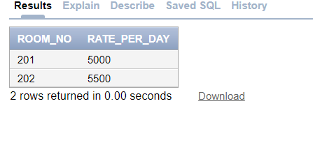


# --------------------------

# Q 10
```
SELECT room_no, CATEGORY
FROM Room
```
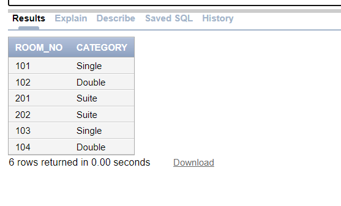
# -------------------------------------------------------------
# Q11:
```
SELECT room_no, rate_per_day
FROM Room
ORDER BY rate_per_day DESC;
```
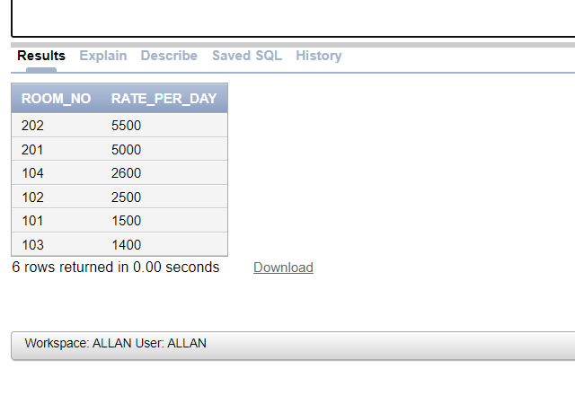

# -------------------------
# Q 12 :
```
SELECT room_no
FROM Room
WHERE occupancy = 'unoccupied';
```

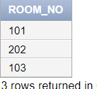

# --------------------------------------------

# Q13:
```
SELECT c.customer_name, r.room_no
FROM Customer1 c 
JOIN Booking b ON c.customer_id = b.customer_id
JOIN Room r ON b.room_id = r.room_id
WHERE c.customer_name LIKE 'A%' AND b.advance_received > 0;
```
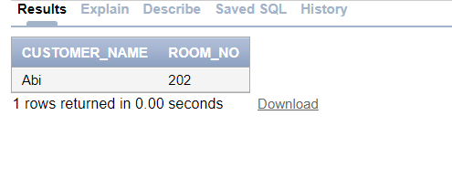


# Q14

```
SELECT room_no, rate_per_day
FROM Room
WHERE rate_per_day < 2000
ORDER BY rate_per_day DESC;
```
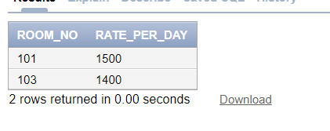

# -----------------------
# Q 15
```
SELECT SUM(rate_per_day) AS total_rate
FROM Room;
```
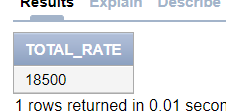

# ---------------------------------